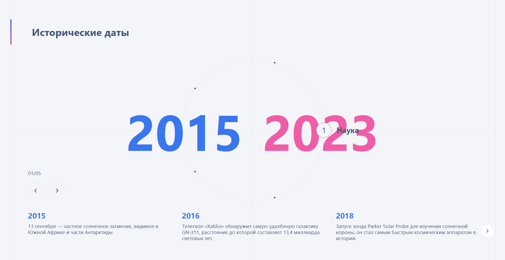

# Исторические даты

📜 Описание проекта
**Historical Dates** — это небольшой проект, созданный для изучения анимационной библиотеки **GSAP** и реализации эффектных анимаций. Основная цель проекта — познакомиться с GSAP, поэкспериментировать с анимациями и улучшить навыки работы с современным стеком разработки.

В проекте представлены исторические даты, визуализированные с использованием красивых анимаций. Дизайн выполнен с акцентом на минимализм и интерактивность.

---

## 🛠️ Стек технологий
- **HTML**
- **CSS** (с использованием **Tailwind CSS** для стилизации)
- **TypeScript**
- **Vite** (для сборки проекта)
- **GSAP** (для создания анимаций)

---

## ✨ Функционал
- Анимация появления и смена состояния для элементов с использованием **GSAP**.
- Адаптивный дизайн благодаря **Tailwind CSS**.
- Простая и интуитивно понятная структура для взаимодействия с контентом.

---

## 🚀 Установка и запуск
1. Клонируйте репозиторий:
   ```bash
   git clone https://github.com/TeleginDmitry/Historical-Dates.git
   ```

2. Перейдите в папку проекта:
   ```bash
   cd historical-dates
   ```

3. Установите зависимости:
   ```bash
   npm install
   ```

4. Запустите проект в режиме разработки:
   ```bash
   npm run dev
   ```

## 📸 Скриншоты


Если вам понравился проект, поставьте ⭐ и делитесь своими идеями в Issues! 😊